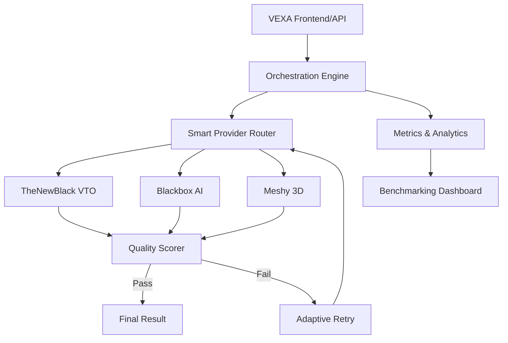

# VEXA AI Intelligence Architecture

VEXA has been transformed into an intelligent AI orchestration platform with the following core components.

## 1. Provider Orchestration Map
The orchestration layer sits between the application logic and external AI providers. It ensures reliability, cost-efficiency, and high quality.

## 2. Smart Routing Logic
- **Latency-Aware**: Selects providers based on real-time average response times.
- **Cost-Aware**: Prioritizes cheaper providers when quality thresholds are met.
- **Reliability-Aware**: Automatically down-ranks providers with high error rates.
- **Fallback Mechanism**: If the primary provider fails or returns low quality, the system automatically switches to the next best provider.

## 3. Quality Scoring & Validation
- **Confidence Estimation**: Every generation is assigned a confidence score.
- **Hallucination Detection**: AI-based vision validation checks for artifacts (e.g., limb count, clipping).
- **Minimum Quality Gates**: Only results exceeding a configurable threshold (e.g., 75/100) are returned to the user.

## 4. Auto-Optimization
- **Adaptive Retries**: Instead of simple retries, the system uses different providers or different prompts on failure.
- **Smart Timeouts**: Timeouts are tuned dynamically based on historical provider performance.
- **Cost Optimization**: The engine balances performance and cost by shifting load to efficient providers during peak usage.

## 5. Analytics & Benchmarking
- **Success Rates**: Tracked per provider.
- **P99 Latency**: Monitored to ensure a "snappy" user experience.
- **Generation Quality Distribution**: Visualized in the admin dashboard to identify model drift.
