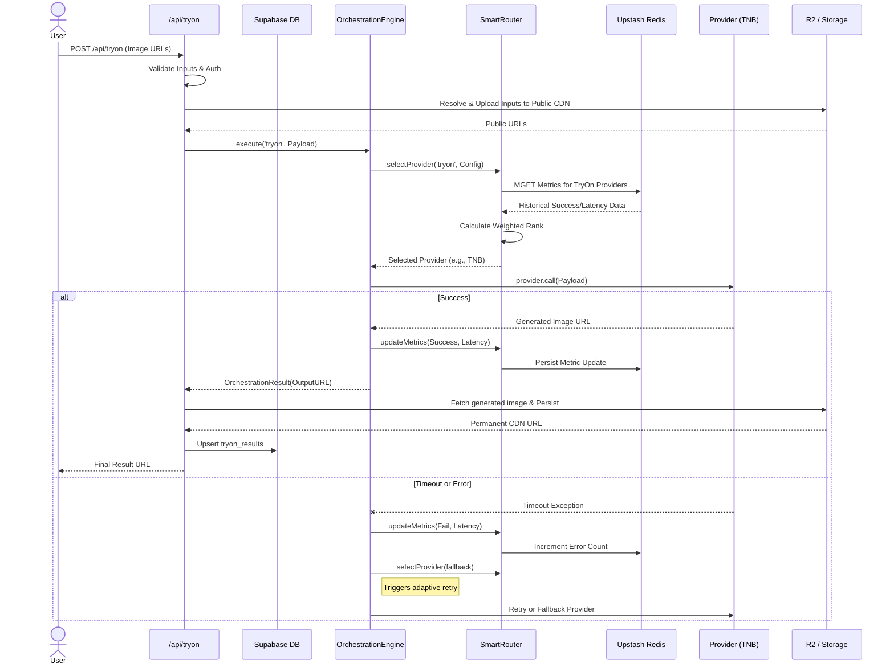

# AI Orchestration Pipeline

The VEXA AI Orchestration Pipeline is designed to abstract away the fragility of generative AI providers, ensuring high availability, optimal latency, and cost-efficiency.

## 1. Request Flow & Provider Routing

The following sequence diagram illustrates how a user request flows through the orchestration engine, including fallback and metric updates.



## 2. Queue Flow (Heavy Tasks)

For long-running tasks like 3D model generation, VEXA uses a decoupled worker queue.

```mermaid
flowchart TD
    API[Client API Request] --> Q[BullMQ (Upstash Redis)]
    Q --> Worker[Background Worker]
    
    subgraph Worker Process
        Worker --> Check[Check Redis Status]
        Check --> Dispatch[Dispatch to Provider]
        Dispatch --> Poll[Poll Provider for Completion]
    end
    
    Poll -->|Success| Save[Save to DB/R2]
    Save --> Notify[Notify Client via WebSocket/Polling]
    
    Poll -->|Failure| Retry[Re-queue Job]
    Retry --> Check
```

## 3. Core Engine Components

### OrchestrationEngine
Acts as the executor. It runs the main `while` loop for retries, handles timeout abort signals, and ensures that failures are caught and logged appropriately without crashing the client request.

### SmartRouter
The decision-maker. It pulls historical data from Upstash Redis.
- **Scoring Algorithm**: Combines baseline provider weight, historical success rate, and historical latency to rank candidates dynamically.
- **Circuit Breaking**: If a provider fails continuously, its success rate drops rapidly, naturally routing traffic away from it until a manual intervention or gradual decay restores it.

### ProviderRegistry
The static inventory of capabilities.
- Stores instances of `AIProvider` subclasses (e.g., `TNBProvider`).
- Declares base capabilities (e.g., `tryon`, `video-gen`), base cost, and expected baseline latency.
