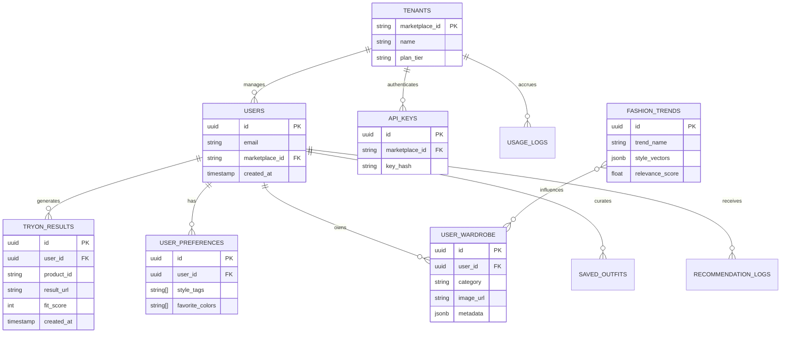

# VEXA Database Architecture

The VEXA platform uses **Supabase (PostgreSQL)** as its primary relational datastore. The schema is optimized for multi-tenancy, rapid analytics, and complex relationships required by the Fashion Intelligence engine.

## Entity Relationship (ER) Diagram

## Core Subsystems

### 1. Core Identity & Multi-Tenancy
- **`users`**: Contains both B2C app users and B2B marketplace proxy users.
- **`tenants`** & **`api_keys`**: Powers the Enterprise SDK. Identifies incoming requests from external brands (e.g., Shopify storefronts) and enforces quotas.

### 2. Generative Assets
- **`tryon_results`**: Persists the outcome of the AI pipeline. Linked to both the user and the specific `product_id` for quick retrieval (caching) if a user tries on the exact same garment again.

### 3. Fashion Intelligence
- **`user_preferences`**: A living document of the user's taste. Updated via implicit feedback (time spent, generations) and explicit feedback (saving items).
- **`user_wardrobe`**: The digitized closet. Contains R2 URLs of segmented garments.
- **`fashion_trends`**: Periodically updated by the `SocialTrendIngestor` worker. Contains vector embeddings used by the `AIStylist` to recommend outfits.

## Data Persistence Flow
1. User uploads a garment.
2. VEXA API streams the image to **Cloudflare R2**.
3. R2 returns a permanent CDN URL.
4. The API writes a new row to `user_wardrobe` containing the metadata and the R2 URL.
5. AI Orchestration requests use the public R2 URL to process the generation.
