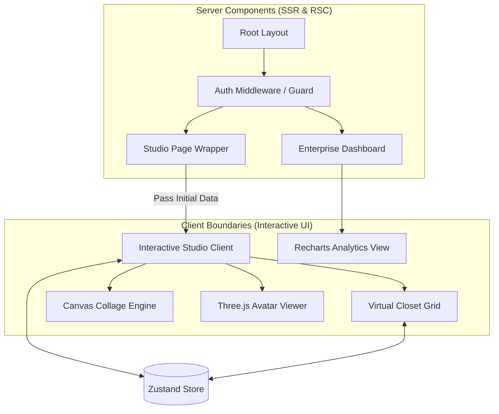

# VEXA Frontend Architecture

VEXA utilizes the **Next.js App Router (React Server Components)** paradigm. The architecture is explicitly optimized to minimize client bundle size, maximize initial render speed, and provide a premium "app-like" experience on mobile browsers.

## Component Hierarchy & Rendering Strategy



## Core Design Principles

### 1. Server-First Mentality
By default, all routes are Server Components. We only push JavaScript to the client (using `"use client"`) at the lowest possible leaf node in the UI tree. This keeps the Time To Interactive (TTI) low on mobile devices.

### 2. Global State via Zustand
Complex nested prop drilling is avoided by using a lightweight `zustand` store (`src/store/useStore.ts`). It manages the global state of the user's active garments, generation status, and selected model.

### 3. Client-Side Compute Offloading
To prevent hitting memory limits on Vercel API routes, intensive visual tasks are pushed to the client:
- **Canvas Collage Engine**: Instead of sending 4 high-res images to the backend to combine them for the AI, the frontend creates a combined canvas output locally via `src/lib/studio/collage.ts` and sends a single optimized Base64 string.

### 4. Dynamic Loading for Heavy Modules
Three.js and 3D Avatar modules are massive dependencies. They are lazily loaded using Next.js `next/dynamic`. If a user never requests a 3D avatar, they never download the Three.js library.

```tsx
const ModelViewer = dynamic(() => import('@/components/studio/ModelViewer'), { ssr: false });
```

## Routing Structure
- `/` - Marketing Shell (Static)
- `/studio` - Main Application Workspace (Protected)
- `/dashboard` - B2B Tenant Analytics (Protected)
- `/api/*` - Edge and Node.js API handlers
