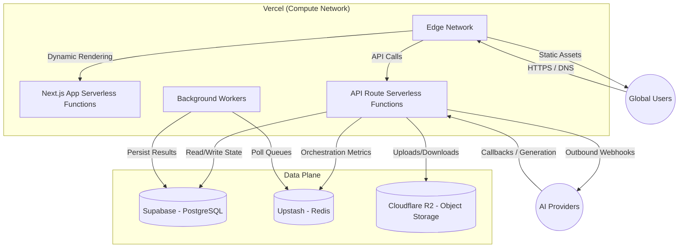

# VEXA Infrastructure & Deployment Topology

VEXA utilizes a modern, serverless-first cloud architecture designed for zero-maintenance scaling and global low latency.

## Deployment Topology

## Core Components

### 1. Compute: Vercel Serverless
- **Hosting**: The entire Next.js application is deployed to Vercel.
- **Scaling Flow**: Requests are handled by Vercel's global edge network. Static assets are served immediately. Dynamic API routes spin up serverless Node.js functions on demand.
- **Environment Propagation**: Controlled via Vercel Environment Variables, syncing locally via `.env`.

### 2. Primary Database: Supabase (PostgreSQL)
- **Usage**: Source of truth for users, analytics, virtual wardrobes, and generated assets metadata.
- **Features**: Utilizes Row Level Security (RLS) to enforce tenant isolation at the database layer.

### 3. High-Speed State: Upstash Redis
- **Usage**: VEXA relies heavily on Redis for serverless coordination. 
- **Persistence**: Because serverless functions lose memory state between cold starts, Upstash provides a sub-10ms REST API to sync AI routing metrics across all global compute nodes.

### 4. Storage Architecture: Cloudflare R2
- **Usage**: Cost-effective storage for large media files (High-res images, MP4 videos, GLB models).
- **CDN**: Assets stored in R2 are served via Cloudflare's global CDN, ensuring blazing-fast asset delivery to the end user with zero egress fees.

## Environment Management
VEXA uses a strictly tiered environment strategy:
- `production`: Fully isolated, connected to production AI API keys.
- `preview`: Automatically generated per Pull Request on Vercel, pointing to staging databases.
- `development`: Local environment utilizing local Supabase and local/staging AI keys.
