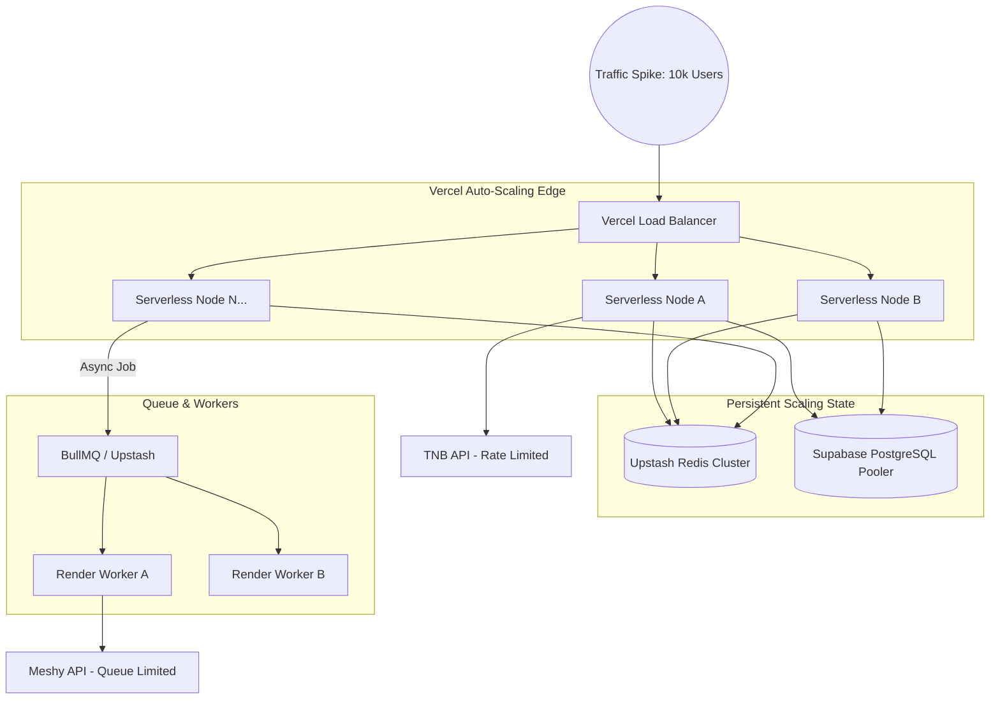

# VEXA Scaling Architecture

VEXA is built to scale from 10 to 10,000 concurrent generations with linear cost and near-zero DevOps overhead.

## Scaling Topology

## Scalability Vectors

### 1. Web Compute (Vercel Serverless)
Because the API routes are stateless and execute on Vercel's Edge/Serverless infrastructure, a traffic spike automatically provisions hundreds of concurrent micro-containers. VEXA never experiences a "server crashed due to memory" event.

### 2. State & Database (PgBouncer & Redis)
- **Supabase**: Connection pooling (via PgBouncer/Supavisor) ensures that 10,000 concurrent serverless functions don't exhaust the PostgreSQL connection limit.
- **Upstash Redis**: Used as the highly concurrent "brain" of the Orchestration Engine. It handles thousands of Read/Write operations per second to maintain global provider health metrics.

### 3. Asynchronous Execution (BullMQ)
For operations that take longer than the strict Serverless timeout (e.g., 3D rendering), we implement the **Queue & Poll** pattern.
1. Vercel API drops a job payload into Upstash Redis via BullMQ.
2. Vercel returns a `jobId` to the client instantly.
3. Long-running Node.js workers (hosted on Render or similar persistent compute) pull jobs off the queue at a controlled rate.
4. This protects downstream AI providers from being DDoS'd by our own traffic spikes.

### 4. Provider Rate Limit Scaling
If TNB enforces a 50 RPS limit, the `OrchestrationEngine` combined with Redis metrics ensures we throttle or reroute traffic to fallback providers (or graceful degradation) before we hit hard 429 Error blocks from the provider.
